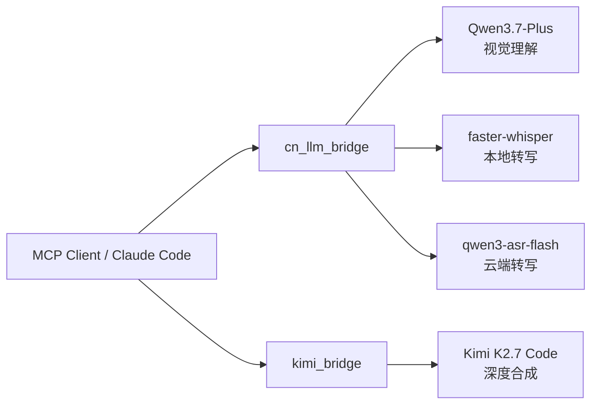

# cn-llm-bridge

[](https://github.com/maxliven/cn-llm-bridge/actions/workflows/ci.yml)
[](https://www.python.org/downloads/)
[](LICENSE)
[](https://modelcontextprotocol.io/)

> MCP Bridge：本地 Qwen 视觉 + faster-whisper 转写，以及 Kimi K2.7 Code 深度合成。

## 这是什么？

**cn-llm-bridge** 是一组 MCP（Model Context Protocol）服务器，把国产大模型的能力接入 Claude Code。



### 模块

| 模块 | 能力 | 本地/远程 | 适用场景 |
|------|------|-----------|---------|
| `cn_llm_bridge` | 视觉理解 + 语音转写 | 混合（视觉远程，转写本地兜底） | 截图分析、OCR、录音转文字 |
| `kimi_bridge` | 深度推理 + 跨模态合成 | 远程 API | 长文本分析、多源综合、代码生成 |

> 主推理模型随你选——Claude 官方、DeepSeek 或任何 OpenAI 兼容模型都可以。cn-llm-bridge 只负责多模态扩展，不绑定主模型。
>
> **模型版本随厂商更新**：所有模型 ID 通过环境变量配置，百炼或 Kimi 发新模型时改一行 `.env` 即可切换，无需改代码。

**核心理念：Claude Code 只调度，不做出力活。** 它负责 orchestration——读需求、派任务、审结果。真正跑推理的那一层，交给最合适的模型。

## 快速开始

### 1. 安装

```bash
git clone https://github.com/maxliven/cn-llm-bridge.git
cd cn-llm-bridge
pip install -e .
```

### 2. 获取 API Key

- **阿里百炼**（必填 — 视觉 + 云端转写）：[bailian.console.aliyun.com](https://bailian.console.aliyun.com/)
- **Kimi**（可选 — 深度合成）：[platform.moonshot.cn](https://platform.moonshot.cn/)

### 3. 配置 Claude Code

在 `~/.claude/mcp.json` 中添加：

```json
{
  "mcpServers": {
    "cn-llm-bridge": {
      "command": "python",
      "args": ["-m", "cn_llm_bridge.server"],
      "env": {
        "QWEN_API_KEY": "sk-your-key-here",
        "BAILIAN_BASE_URL": "https://dashscope.aliyuncs.com/compatible-mode/v1"
      }
    },
    "kimi-bridge": {
      "command": "python",
      "args": ["-m", "kimi_bridge.server"],
      "env": {
        "KIMI_API_KEY": "sk-your-key-here",
        "KIMI_BASE_URL": "https://api.moonshot.cn/v1"
      }
    }
  }
}
```

重启 Claude Code，问它「你能看到什么 MCP 工具？」——会列出 `vision_analyze`、`audio_transcribe`、`kimi_chat` 等。

### 4. 开始用

在 Claude Code 中直接说人话：

- 「分析这张截图」→ 自动调用 `vision_analyze`
- 「把这段录音转成文字」→ 自动调用 `audio_transcribe`
- 「对比这三张设计稿的变化」→ 先逐张 `vision_analyze`，再 `kimi_synthesize` 综合

> 💡 **切换模型版本**：所有模型 ID 都支持环境变量覆盖。百炼发新模型时，改一行配置即可——无需改代码。见 `.env.example`。

---

## 可用工具

| 工具 | 用途 | 模型 |
|------|------|------|
| `vision_analyze` | 图片分析，返回结构化 JSON | Qwen3.7-Plus |
| `vision_chat` | 多轮视觉对话 | Qwen3.7-Plus |
| `audio_transcribe` | 音频转文字 | qwen3-asr-flash → faster-whisper（兜底） |
| `kimi_chat` | 深度推理、长文本分析 | Kimi K2.7 Code |
| `kimi_synthesize` | 多源综合、跨模态合成 | Kimi K2.7 Code |
| `tools_health` / `kimi_health` | 检查模型状态 | — |

---

## 设计原则

### 原则一：Generator ≠ Evaluator

**写作业和批作业的不能是同一个人。** 同一个模型审查自己的输出时有严重确认偏误——生成时走错路，审查时大概率走同一条路，然后告诉你"没问题"。

Claude Code 只调度和审查，推理交给独立模型。两个模型的思考路径彼此独立，一个的盲点被另一个照亮。

### 原则二：结构化输出 >> 自由文本

让子模型返回 JSON，主模型只读关键字段。一个 `summary: "登录按钮错位"` 是 15 个 token，让主模型自己理解整张截图可能要 500 个。

`vision_analyze` 返回结构化 JSON（`summary`、`details`、`text_found`、`objects`），主模型只需读字段做决策。

### 原则三：参数按场景差异化

OCR 用高清，场景描述低分辨率就够。`_infer_detail_level` 根据 prompt 内容自动推断——你的提问里有「文字」「识别」「OCR」就自动切高清。

### 原则四：透传层格式约束

模型有时返回「带 markdown 包裹的 JSON」——直接解析会炸。`_ensure_json` 自动剥离、修复。格式错误最大的成本不是报错，是排查报错浪费的时间。

---

## 工程决策

### 复杂度自评估

`vision_analyze` 让模型自己评估任务复杂度（simple / medium / complex），自动控制 `details` 字段长度。过滤掉 80% 的低信息密度输出。

### 自适应 max_tokens

| 任务类型 | max_tokens | 示例 |
|---------|-----------|------|
| 搜索/列举/格式化 | 300–500 | 列出页面按钮 |
| 分类/匹配/检查 | 500–800 | 判断截图有无报错 |
| 分析/总结/提取 | 800–1200 | 总结扫描件要点 |
| 生成/写作/翻译 | 1200–2000 | 基于数据写分析 |

### 单次重试

遇到 5xx 等 1.5 秒重试一次——就一次。过度重试是用更多请求撞同一堵墙。

---

## 项目结构

```
cn-llm-bridge/
├── README.md
├── LICENSE
├── pyproject.toml
├── .env.example
├── .gitignore
├── cn_llm_bridge/          # cn-llm-bridge MCP server
│   ├── __init__.py
│   └── server.py
├── kimi_bridge/            # kimi-bridge MCP server
│   ├── __init__.py
│   └── server.py
└── docs/
    └── ARCHITECTURE.md     # 架构详解
```

## 依赖

- Python ≥ 3.10
- `mcp` — MCP 协议 SDK
- `httpx` — 异步 HTTP 客户端
- `faster-whisper` — 本地音频转写（可选，CPU 就能跑）

## 常见问题

**需要 GPU 吗？** 不需要。faster-whisper 用 INT8 量化，CPU 足够。视觉和深度合成都走云端 API。

**支持哪些音频格式？** m4a、mp3、wav、ogg、flac 等。云端转写是主路径，本地 faster-whisper 是兜底。

**和直接用 Claude 官方多模态有什么区别？** Claude 官方多模态是最好的选择——如果你能稳定使用。cn-llm-bridge 解决的是另一个问题：模型多样性 + 稳定可控。

## License

MIT © 2026

---

*AI 能力不是越强越好，是越「对」越好。*

---

## Ecosystem

- [cc-skill-router](https://github.com/maxliven/cc-skill-router) — Skill routing system for Claude Code. Register `cn-llm-bridge` tools as skills for automatic routing.

---
🌐 Part of the [maxliven](https://github.com/maxliven) AI tooling ecosystem:
[cc-skill-router](https://github.com/maxliven/cc-skill-router) ·
[cn-llm-bridge](https://github.com/maxliven/cn-llm-bridge)
